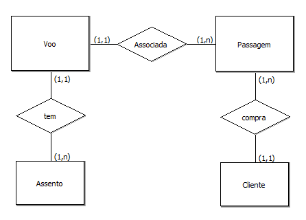
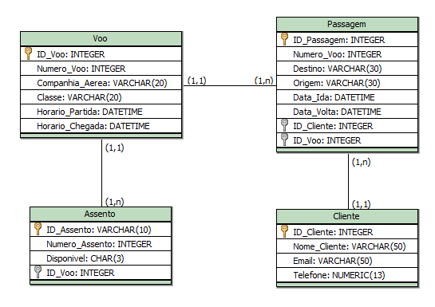

# ExploraMundo | Descubra o Inexplorado - Agência de Viagem

## 📌 Sobre o Projeto
Este projeto consiste na simulação do site inicial de uma agência de viagens fictícia, com foco na estruturação da interface e no planejamento do banco de dados.

## 📌 Funcionalidades
A aplicação oferece funcionalidades voltadas para a experiencia do usuário na reserva de passagens e pacotes de viagem, incluindo:

🔹 Cadastro e autenticação de usuários

🔹 Pesquisa de voos por origem, destino e data

🔹 Informações sobre hospedagem

🔹 Opções adicionais: Seguro viagem


*Nesta fase inicial, ainda não foram totalmente implementadas funcionalidades dinâmicas ou sistemas interativos.*

## 📌 Tecnologias Utilizadas
🔹 Frontend: HTML, CSS, Bootstrap, JavaScript (fase inicial)

🔹 Banco de Dados: MySQL (modelado no BrModelo)

____

## 📌 Modelagem do Banco de Dados
O banco de dados foi modelado com base no BRModelo, utilizando três níveis de abstração:

🔹 Conceitual → Representação das entidades e seus relacionamentos principais.

🔹 Lógico → Definição de atributos e estrutura detalhada.

🔹 Físico → Implementação final, incluindo a geração do script SQL para criação das tabelas.

Sendo assim, com base no formulário de busca de passagens, foi modelado um banco de dados com as seguintes tabelas principais:

🔹 Cliente → Realiza a compra de passagens.

🔹 Passagem → Contém informações sobre origem, destino e data.

🔹 Voo → Relacionado a passagens e assentos disponíveis.

🔹 Assento → Associado a um voo e pode ser reservado.

*O modelo segue o esquema 1:N entre Cliente e Passagem, N:1 entre Passagem e Voo, e 1:N entre Voo e Assentos disponíveis.*

| *Modelo Conceitual* |
|-|
||

| *Modelo Lógico* |
|-|
||

**Modelo Físico**

```sql
CREATE TABLE Cliente (
	Nome_Cliente VARCHAR(50),
	Email VARCHAR(20),
	Telefone NUMERIC(13),
	ID_Cliente INTEGER PRIMARY KEY
);

CREATE TABLE Passagem (
	Numero_Voo INTEGER,
	Destino VARCHAR(20),
	Origem VARCHAR(10),
	ID_Passagem INTEGER PRIMARY KEY,
	Data_Ida DATETIME,
	Data_Volta DATETIME,
	ID_Cliente INTEGER,
	ID_Voo INTEGER,
  FOREIGN KEY(ID_Voo) REFERENCES Voo (ID_Voo),
	FOREIGN KEY(ID_Cliente) REFERENCES Cliente (ID_Cliente)
);

CREATE TABLE Voo (
	Horario_Partida DATETIME,
	Companhia_Aerea VARCHAR(10),
	Classe VARCHAR(10),
	Horario_Chegada DATETIME,
	ID_Voo INTEGER PRIMARY KEY,
	Numero_Voo INTEGER
);

CREATE TABLE Assento (
	ID_Assento VARCHAR(10) PRIMARY KEY,
	Numero_Assento INTEGER,
	Disponivel CHAR(3),
	ID_Voo INTEGER,
	FOREIGN KEY(ID_Voo) REFERENCES Voo (ID_Voo)
);
```

___
## 📌 Próximos Passos
🔹 Implementação de funcionalidades dinâmicas com JavaScript e backend.

🔹 Criação do banco de dados no MySQL com base no diagrama físico.

🔹 Desenvolvimento da lógica de reserva e autenticação de usuários.

___

#### Link de Acesso ao Site: *https://hirislaynebatista.github.io/Agencia-de-Viagem/*

#
*Desenvolvido por: Hirislayne Batista.*
#


